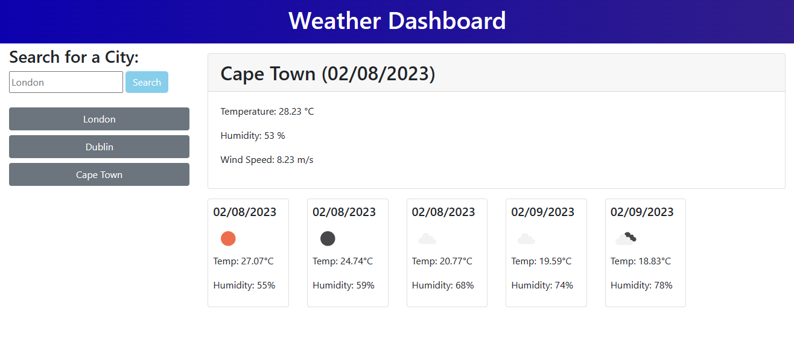

# Weather Forcast Dashboard
This is a weather dashboard.

## Description
Using the OpenWeather API, this site allows one to search for a city of their choice and give a forcast for the upcoming days. It will also save the search to Local Storage and allow the user to click back on a city they have chosen. 

<i>How the app will appear in the browser</i>

### Deployed site URL:

https://ad0m.github.io/WeatherForcast/

## Configuration

Copy `assets/js/config.example.js` to `assets/js/config.js` and replace `YOUR_API_KEY_HERE` with your OpenWeather API key. You should also provide a `PIXABAY_KEY` for fetching city images. The `config.js` file is ignored by Git so your personal keys will remain private.
